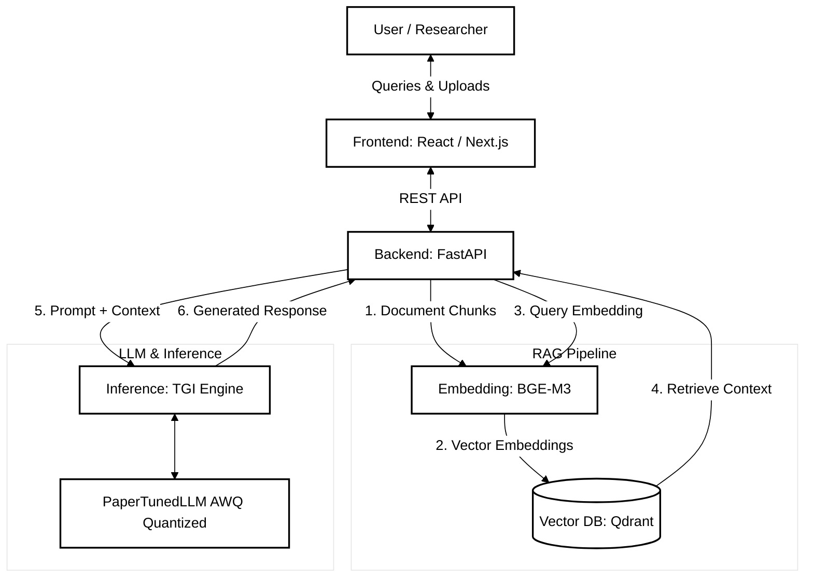

---
pdf_options:
  format: A4
  margin: 20mm
  printBackground: false
---

# PaperTunedLLM Project Documentation

## 1. Executive Summary

**PaperTunedLLM** is a production-ready AI Research Assistant specialized in Machine Learning research papers. It is built using modern open-source Large Language Model (LLM) technologies and demonstrates the complete lifecycle of adapting an LLM, encompassing fine-tuning, evaluation, quantization, retrieval-augmented generation (RAG), and deployment.

## 2. Architecture and Core Components

The project architecture is composed of several functional layers integrated to provide a robust research assistant.

### 2.1 Data & Base Model
* **Base LLM:** Qwen 2.5 3B, providing the foundation for general understanding.
* **Dataset:** Existing public scientific datasets (e.g., QASPER) utilized for supervised fine-tuning.

### 2.2 Training Pipeline
* **Methodology:** QLoRA for efficient supervised fine-tuning, yielding the specialized PaperTunedLLM.
* **Frameworks:** LlamaFactory and Unsloth for optimized training.

### 2.3 Evaluation & Optimization
* **Evaluation:** Rigorous comparative analysis against the base model, measuring scientific QA performance, paper understanding, hallucination rates, and reasoning quality.
* **Quantization:** AWQ quantization to reduce GPU memory footprint while maintaining accuracy, ensuring an efficient production model.

### 2.4 Retrieval-Augmented Generation (RAG)
* **Embedding Model:** BGE-M3 for converting document chunks into vector representations.
* **Vector Database:** Qdrant for storing embeddings and enabling rapid semantic retrieval.

### 2.5 Application Layer
* **Inference Engine:** Text Generation Inference (TGI) for serving the quantized model efficiently in a production setting.
* **Backend:** FastAPI to handle requests, orchestrate RAG retrieval, and interface with the LLM.
* **Frontend:** React and Next.js providing the user interface for uploading papers, querying the knowledge base, and analyzing research.

### 2.6 Deployment
* **Infrastructure:** Docker Compose for a unified, single-command deployment workflow.

## 3. System Architecture Diagram

## 4. System Workflows

### 4.1 Training Flow
1. **Public Dataset** processing.
2. **QLoRA Fine-Tuning** using LlamaFactory/Unsloth.
3. **Evaluation** of model metrics against baseline.
4. **AWQ Quantization** for optimization.
5. **Production Model** readiness.

### 4.2 Retrieval (RAG) Flow
1. **Scientific Papers** ingestion.
2. **Chunking** the documents into logical pieces.
3. **BGE-M3 Embedding** generation.
4. **Qdrant Vector DB** storage and indexing.
5. **Retriever** fetching context.
6. **PaperTunedLLM** generation based on retrieved context.

### 4.3 User Interaction Flow
1. Researcher interacts with the Web UI.
2. Request is forwarded to the FastAPI backend.
3. BGE-M3 generates a query embedding.
4. Qdrant performs a semantic search to identify relevant document chunks.
5. PaperTunedLLM receives the prompt augmented with the retrieved chunks.
6. A grounded, accurate response is generated and returned to the user.

## 5. Technology Stack Overview

| Component | Technology |
| :--- | :--- |
| **Base Model** | Qwen 2.5 3B |
| **Fine-Tuning** | QLoRA |
| **Quantization** | AWQ |
| **Embedding Model** | BGE-M3 |
| **Vector Database** | Qdrant |
| **Inference** | Text Generation Inference (TGI) |
| **Backend Framework** | FastAPI |
| **Frontend Framework** | React / Next.js |
| **Containerization** | Docker |
