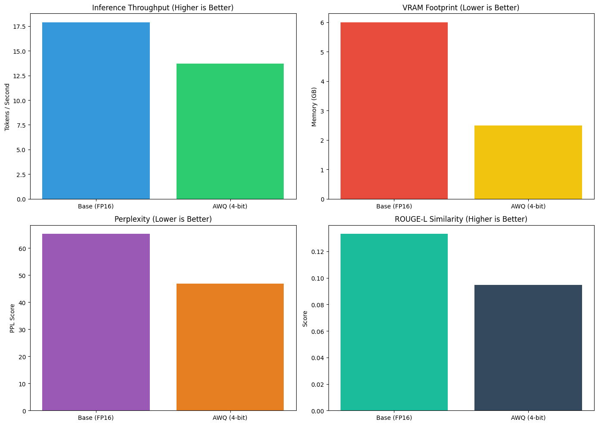
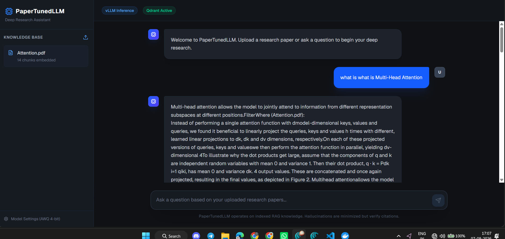

# PaperTunedLLM (Qwen2.5-3B | Fine-Tuned on QASPER | AWQ | RAG | TGI )

PaperTunedLLM is a production-ready AI Research Assistant specialized in Machine Learning research papers. It is built using modern open-source Large Language Model (LLM) technologies and demonstrates the complete lifecycle of adapting an LLM, encompassing fine-tuning, evaluation, quantization, retrieval-augmented generation (RAG), and deployment. 

## Experimental Results

The following charts demonstrate the evaluation results of the base model versus the quantized and fine-tuned models.

### Base vs Quantized Model Performance

### Testing and Inference Metrics

## Architecture and Core Components

The project architecture is composed of the following functional layers:

1.  **Data & Base Model**
    *   **Base LLM:** Qwen 2.5 3B, providing the foundation for general understanding.
    *   **Dataset:** Existing public scientific datasets utilized for supervised fine-tuning.

2.  **Training Pipeline**
    *   **Methodology:** QLoRA for efficient supervised fine-tuning, yielding the specialized PaperTunedLLM.
    *   **Frameworks:** LlamaFactory and Unsloth for optimized training.

3.  **Evaluation & Optimization**
    *   **Evaluation:** Rigorous comparative analysis against the base model, measuring scientific QA performance, paper understanding, hallucination rates, and reasoning quality.
    *   **Quantization:** AWQ quantization to reduce GPU memory footprint while maintaining accuracy, ensuring an efficient production model.

4.  **Retrieval-Augmented Generation (RAG)**
    *   **Embedding Model:** BGE-M3 for converting document chunks into vector representations.
    *   **Vector Database:** Qdrant for storing embeddings and enabling rapid semantic retrieval.

5.  **Application Layer**
    *   **Inference Engine:** Text Generation Inference (TGI) for serving the quantized model efficiently in a production setting.
    *   **Backend:** FastAPI to handle requests, orchestrate RAG retrieval, and interface with the LLM.
    *   **Frontend:** React and Next.js providing the user interface for uploading papers, querying the knowledge base, and analyzing research.

6.  **Deployment**
    *   **Infrastructure:** Docker Compose for a unified, single-command deployment workflow.

## System Workflows

### Training Flow
`Public Dataset` -> `QLoRA Fine-Tuning` -> `Evaluation` -> `AWQ Quantization` -> `Production Model`

### Retrieval (RAG) Flow
`Scientific Papers` -> `Chunking` -> `BGE-M3 Embedding` -> `Qdrant Vector DB` -> `Retriever` -> `PaperTunedLLM`

### User Interaction Flow
1.  Researcher interacts with the Web UI.
2.  Request is forwarded to the FastAPI backend.
3.  BGE-M3 generates a query embedding.
4.  Qdrant performs a semantic search to identify relevant document chunks.
5.  PaperTunedLLM receives the prompt augmented with the retrieved chunks.
6.  A grounded, accurate response is generated and returned to the user.

## Technology Stack

*   **Base Model:** Qwen 2.5 3B
*   **Fine-Tuning:** QLoRA
*   **Quantization:** AWQ
*   **Embedding Model:** BGE-M3
*   **Vector Database:** Qdrant
*   **Inference:** Text Generation Inference (TGI)
*   **Backend Framework:** FastAPI
*   **Frontend Framework:** React / Next.js
*   **Containerization:** Docker